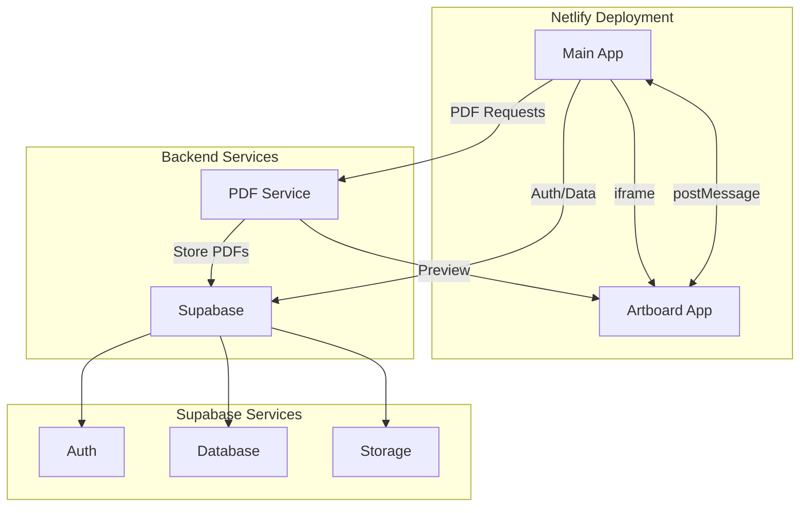

# Supabase Migration Plan

## Architecture Overview

### 1. Frontend Apps (Single Netlify Deployment)
- Monorepo structure maintained
- Main App:
  - Primary user interface
  - Authentication via Supabase
  - Resume editing and management
  - Embeds artboard via iframe
- Artboard App:
  - Isolated resume rendering
  - Receives data via postMessage
  - Independent styling (CSS Variables + Tailwind)
  - Three display modes (Builder, Preview, Printer)

### 2. PDF Generation Service
- Minimal NestJS server
- Puppeteer/Chrome for PDF generation
- Connects to Supabase for storage
- Maintains existing iframe-based preview

### 3. Supabase Services
- Authentication
- Database
- Storage (resumes, previews)

## Modified Architecture



## Required Changes

### 1. Environment Configuration
```env
# PDF Service Requirements
CHROME_URL=ws://localhost:8080
CHROME_TOKEN=chrome_token

# Supabase Configuration
SUPABASE_URL=your-project-url
SUPABASE_ANON_KEY=your-anon-key
SUPABASE_SERVICE_ROLE_KEY=your-service-role-key
```

### 2. Frontend Updates
- Integrate Supabase client
- Maintain existing app structure
- Keep iframe communication pattern
```typescript
// Example: Main app to artboard communication remains unchanged
const sendDataToArtboard = (data) => {
  const artboardFrame = document.querySelector('#artboard-frame');
  artboardFrame.contentWindow.postMessage({ type: 'UPDATE_RESUME', data }, '*');
};
```

### 3. PDF Service Updates
- Update storage to use Supabase
- Maintain iframe-based preview
- Keep Chrome service for PDF generation

## Implementation Steps

1. Set up Supabase project
   - Configure auth providers
   - Set up storage buckets
   - Migrate database schema

2. Update Backend Services
   - Migrate storage to Supabase
   - Update PDF service configuration

3. Update Frontend
   - Integrate Supabase client
   - Update API endpoints
   - Test PDF generation flow

4. Deploy to Netlify
   - Configure build settings for monorepo
   - Set up environment variables
   - Test full application flow

## Benefits
- Single deployment simplicity
- Maintained app isolation through iframe
- Clean styling separation
- Improved scalability with Supabase

## Risks and Mitigations

1. PDF Generation
   - Risk: Service availability
   - Mitigation: Implement retries and queueing

2. Data Migration
   - Risk: Data loss during migration
   - Mitigation: Backup before migration

3. Auth Transition
   - Risk: Session interruption
   - Mitigation: Plan transition period