

  

### [Warp, built for coding with multiple AI agents.](https://go.warp.dev/Reactive-Resume)

[Available for MacOS, Linux, & Windows](https://go.warp.dev/Reactive-Resume) 

---

# Reactive Resume

A free and open-source resume builder that simplifies the process of creating, updating, and sharing your resume.

### [Go to App](https://rxresu.me/) | [Docs](https://docs.rxresu.me/)

## Description

Reactive Resume is a free and open-source resume builder that simplifies the process of creating, updating, and sharing your resume. With zero user tracking or advertising, your privacy is a top priority. The platform is extremely user-friendly and can be self-hosted in less than 30 seconds if you wish to own your data completely.

It's available in multiple languages and comes packed with features such as real-time editing, dozens of templates, drag-and-drop customisation, and integration with OpenAI for enhancing your writing.

You can share a personalised link of your resume to potential employers, track its views or downloads, and customise your page layout by dragging-and-dropping sections. The platform also supports various font options and provides dozens of templates to choose from. And yes, there's even a dark mode for a more comfortable viewing experience.

Start creating your standout resume with Reactive Resume today!

## Templates

| Azurill                                                                 | Bronzor                                                                 | Chikorita                                                                 |
| ----------------------------------------------------------------------- | ----------------------------------------------------------------------- | ------------------------------------------------------------------------- |
| 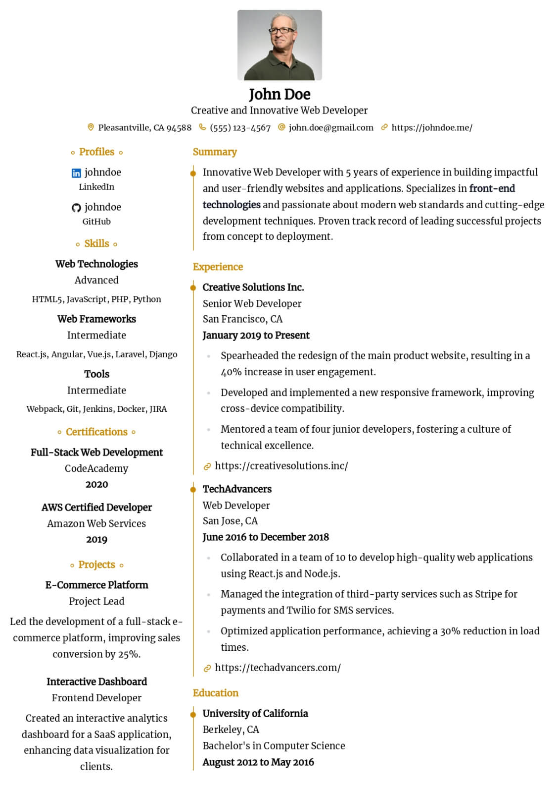 | 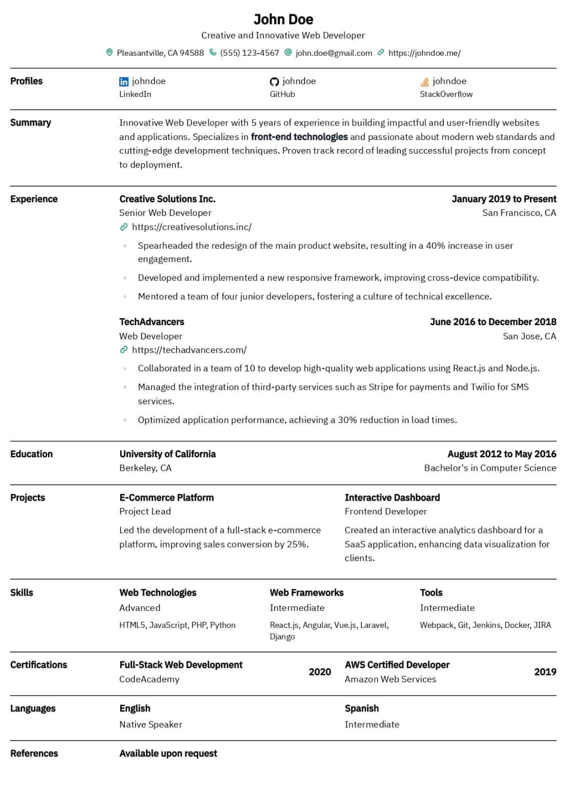 | 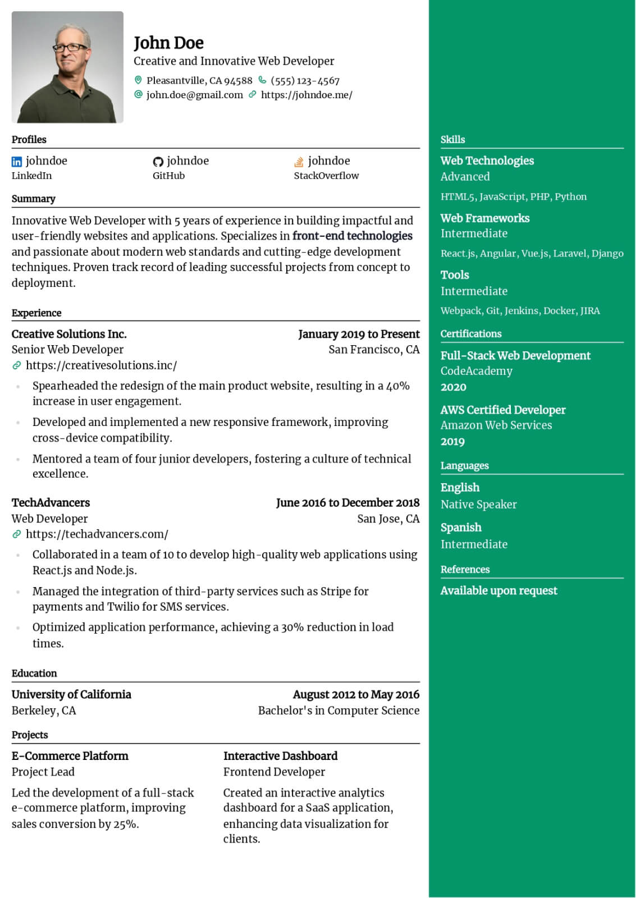 |

| Ditto                                                                | Gengar                                                                 | Glalie                                                                 |
| -------------------------------------------------------------------- | ---------------------------------------------------------------------- | ---------------------------------------------------------------------- |
| 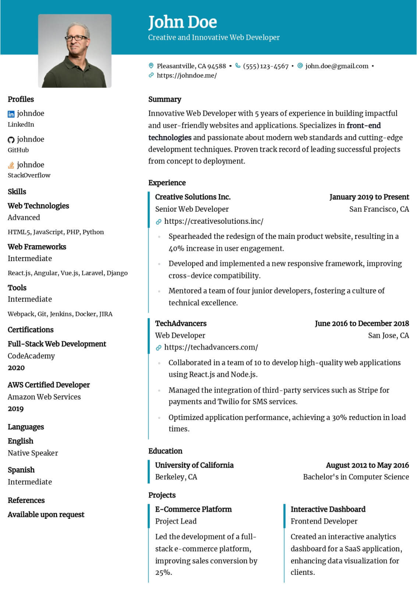 | 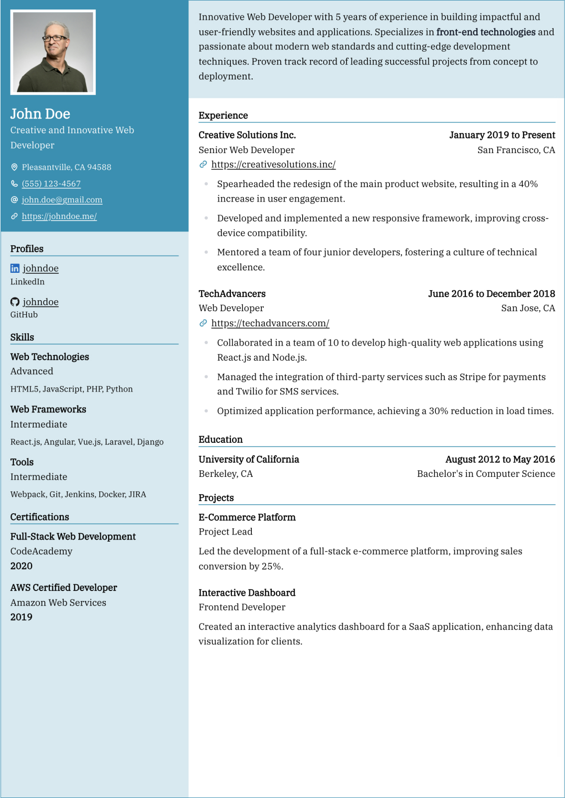 | 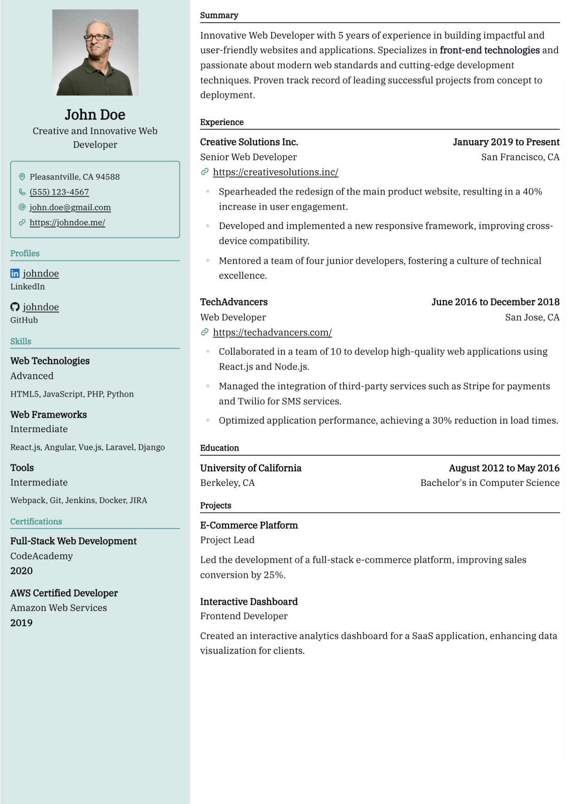 |

| Kakuna                                                                 | Leafish                                                                 | Nosepass                                                                 |
| ---------------------------------------------------------------------- | ----------------------------------------------------------------------- | ------------------------------------------------------------------------ |
| 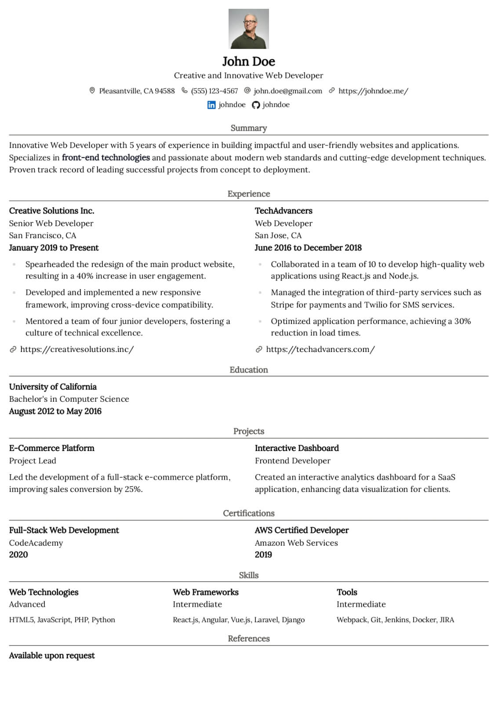 | 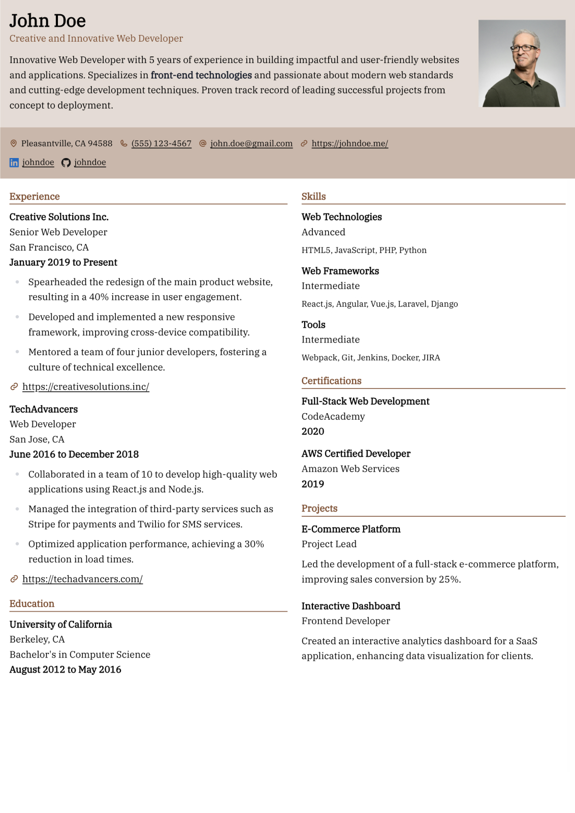 | 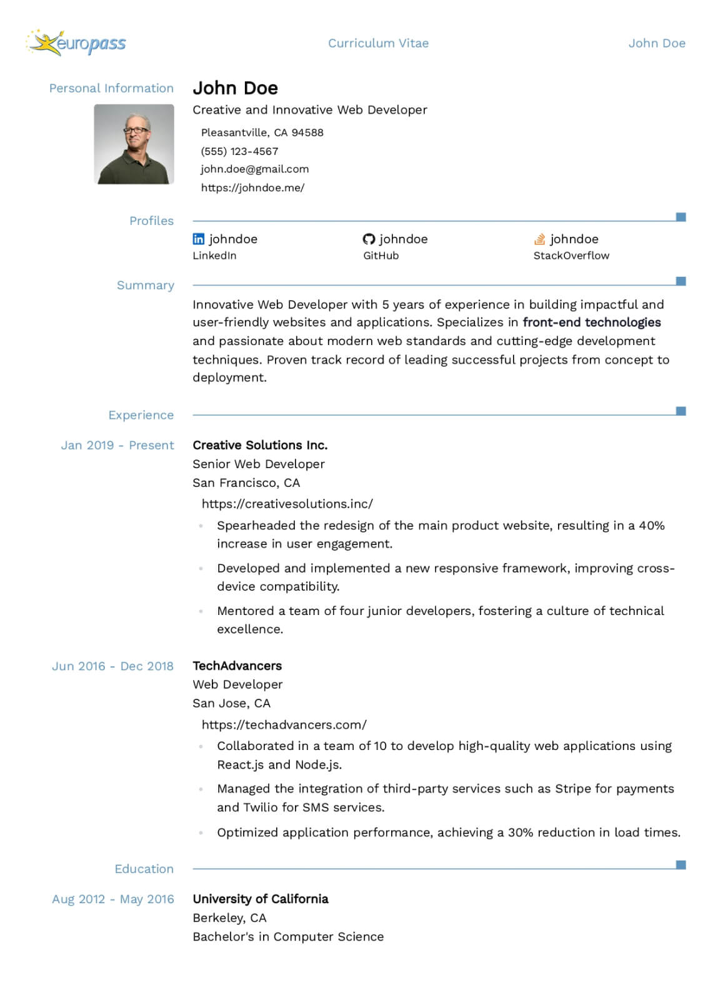 |

| Onyx                                                                | Pikachu                                                                 | Rhyhorn                                                                 |
| ------------------------------------------------------------------- | ----------------------------------------------------------------------- | ----------------------------------------------------------------------- |
| 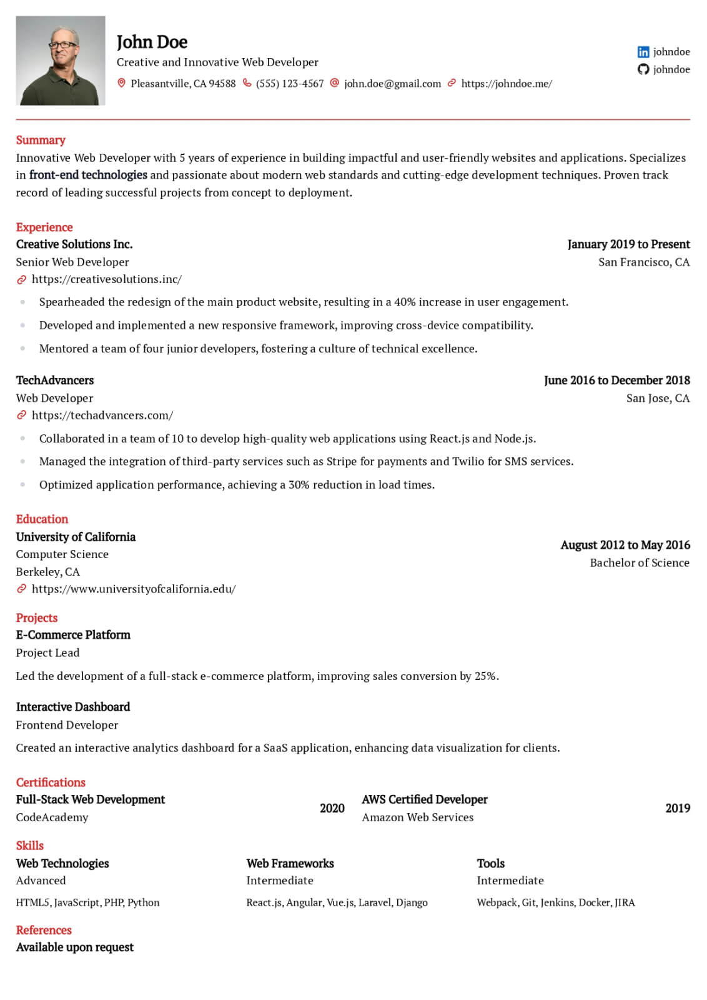 | 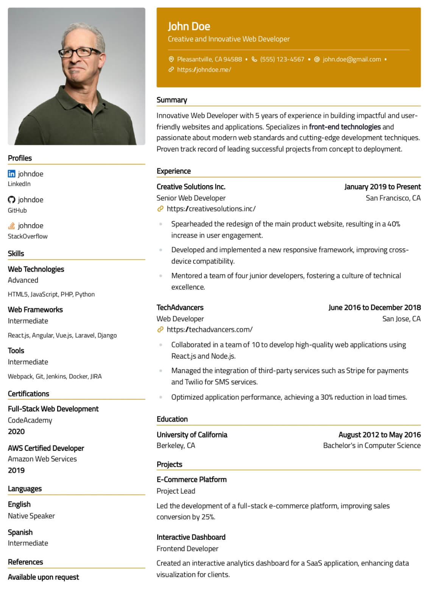 | 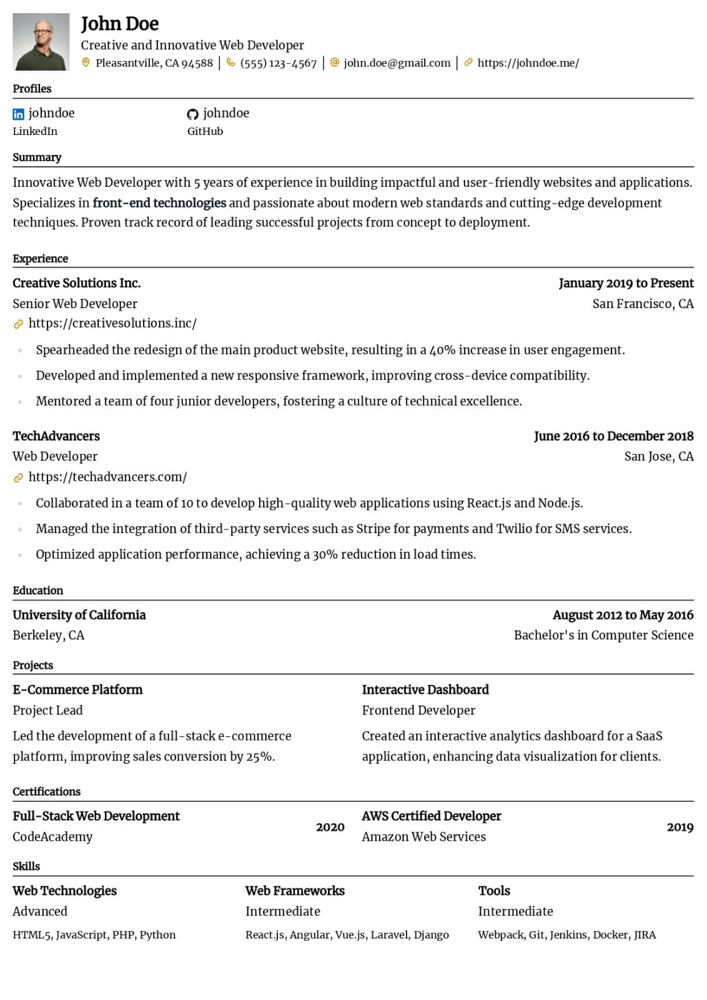 |

## Features

- **Free, forever** and open-source
- No telemetry, user tracking or advertising
- You can self-host the application in less than 30 seconds
- **Available in multiple languages** ([help add/improve your language here](https://translate.rxresu.me/))
- Use your email address (or a throw-away address, no problem) to create an account
- You can also sign in with your GitHub or Google account, and even set up two-factor authentication for extra security
- Create as many resumes as you like under a single account, optimising each resume for every job application based on its description for a higher ATS score
- **Bring your own OpenAI API key** and unlock features such as improving your writing, fixing spelling and grammar or changing the tone of your text in one-click
- Translate your resume into any language using ChatGPT and import it back for easier editing
- Create single page resumes or a resume that spans multiple pages easily
- Customize the colours and layouts to add a personal touch to your resume
- Customise your page layout as you like just by dragging-and-dropping sections
- Create custom sections that are specific to your industry if the existing ones don't fit
- Jot down personal notes specific to your resume that's only visible to you
- Lock a resume to prevent making any further edits (useful for master templates)
- **Dozens of templates** to choose from, ranging from professional to modern
- Design your resume using the standardised EuroPass design template
- Supports printing resumes in A4 or Letter page formats
- Design your resume with any font that's available on [Google Fonts](https://fonts.google.com/)
- **Share a personalised link of your resume** to companies or recruiters for them to get the latest updates
- You can track the number of views or downloads your public resume has received
- Built with state-of-the-art (at the moment) and dependable technologies that's battle tested and peer reviewed by the open-source community on GitHub
- **MIT License**, so do what you like with the code as long as you credit the original author
- And yes, there’s a dark mode too 🌓

## Built With

- React (Vite), for the frontend
- NestJS, for the backend
- Postgres (primary database)
- Prisma ORM, which frees you to switch to any other relational database with a few minor changes in the code
- Minio (for object storage: to store avatars, resume PDFs and previews)
- Browserless (for headless chrome, to print PDFs and generate previews)
- SMTP Server (to send password recovery emails)
- GitHub/Google OAuth (for quickly authenticating users)
- LinguiJS and Crowdin (for translation management and localization)

## Star History

<a href="https://star-history.com/#AmruthPillai/Reactive-Resume&Date">
  <picture>
    <source media="(prefers-color-scheme: dark)" srcset="https://api.star-history.com/svg?repos=AmruthPillai/Reactive-Resume&type=Date&theme=dark" />
    <source media="(prefers-color-scheme: light)" srcset="https://api.star-history.com/svg?repos=AmruthPillai/Reactive-Resume&type=Date" />
    
  </picture>
</a>

## License

Reactive Resume is packaged and distributed using the [MIT License](/LICENSE.md) which allows for commercial use, distribution, modification and private use provided that all copies of the software contain the same license and copyright.

_By the community, for the community._  
A passion project by [Amruth Pillai](https://www.amruthpillai.com/)

  

