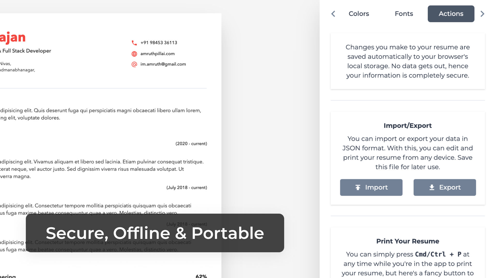
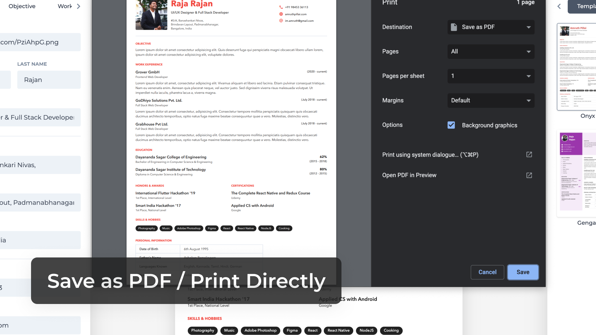
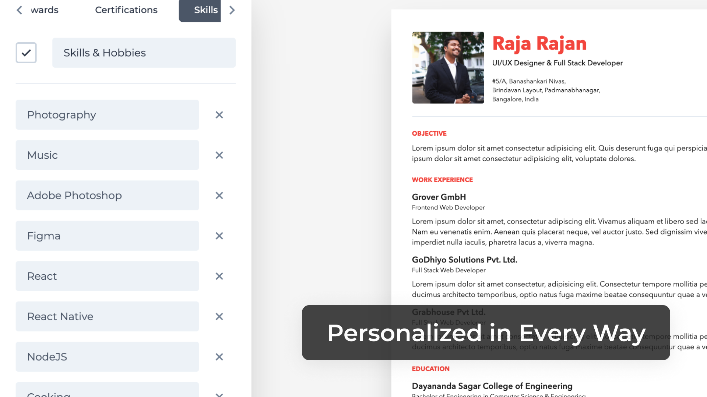
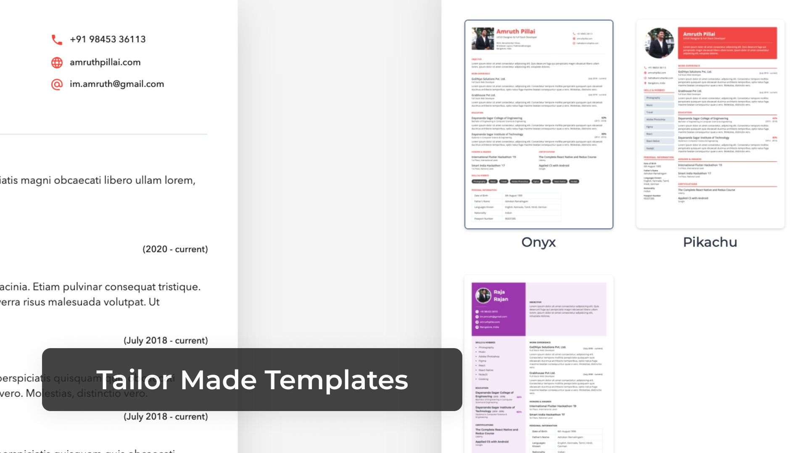
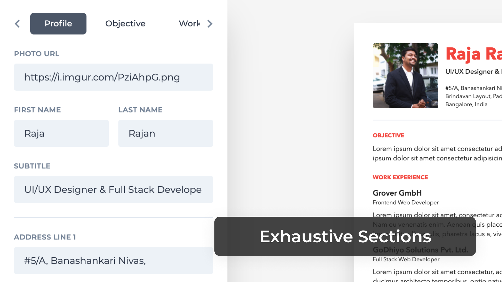
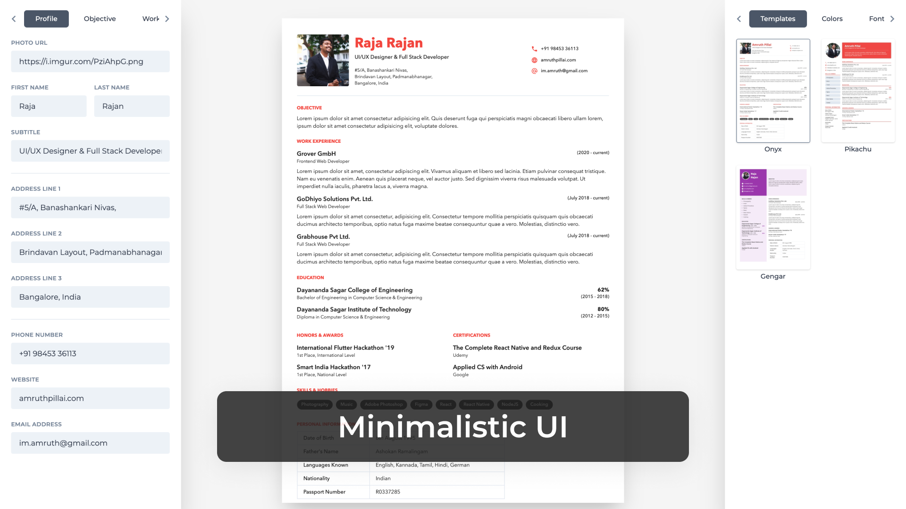

# Features

I've tried to maintain some core principles to the app that will always remain unchanged, just to set a fixed direction in which development and ideas can move forward.

  <iframe width="100%" height="420" src="https://www.youtube.com/embed/4OM0LEPzDO8" frameborder="0" allow="accelerometer; autoplay; encrypted-media; gyroscope; picture-in-picture" allowfullscreen></iframe>

## Secure

It is entirely secure, as in, your information never leaves the browser, powered by web technologies (HTML5 Local Storage API) that allow for data to be stored locally and quickly.

## Offline

The app is a PWA and also has no connection to any servers, thus keeping it entirely offline. It survives refreshes, disconnections, and can also be exported or imported through JSON.

## Customizable

Choose your fonts, play with the colors, pick any layout by merely enabling/disabling sections. A simple and easy to use interface that helps you get a resume in no time!

## Templates

I've been continuously designing new templates and will be releasing new ones as I have the time. Please support development by using the app and leaving a like/comment or sharing it with your peers.

## Portable

Your information can be exported to JSON and imported back into the application from anywhere, all you need is your JSON file. This feature makes it easy to update your resume, upload your file (or have it preloaded from local storage), edit the resume and download it again or print it as PDF.

## Minimalistic Design

As a designer, I felt I had to put this over the top of all other features. Built with minimalism and minimal interaction in mind, it looks clean, is simple to use, and I only hope to make the process more streamlined through your inputs and feedback.

## Progressive Web App

The web app is responsive, which means you can edit your resume on your phone as well and even install it as an app if you're on Android/Chrome. The app is quick to load and would also work if your internet is disconnected.

## Free and Open-Source

As with all my projects, I made the app only to help others, so it will always remain free, and I would not be monetizing on it at any point. But if you do feel generous, [I'm open to donations](https://opencollective.com/reactive-resume).
