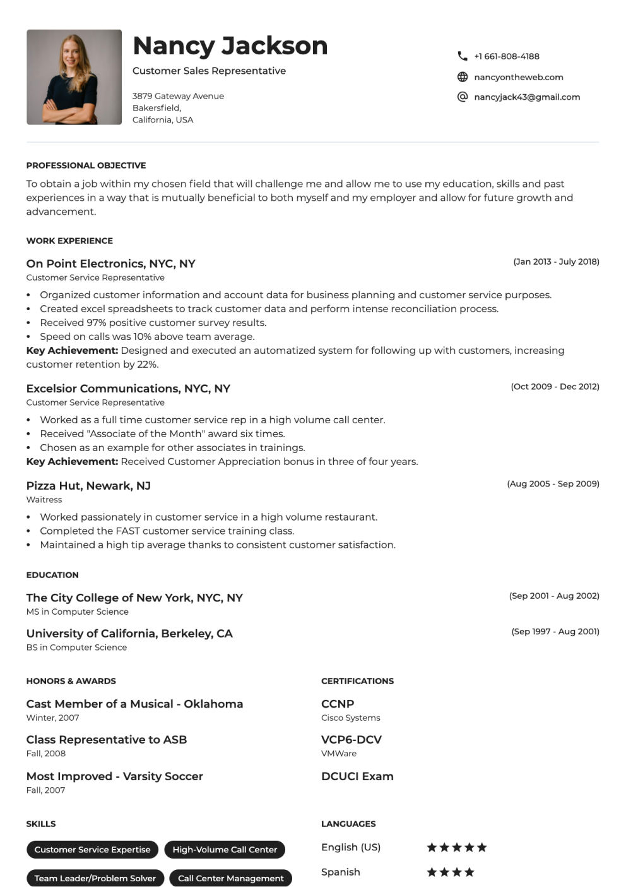
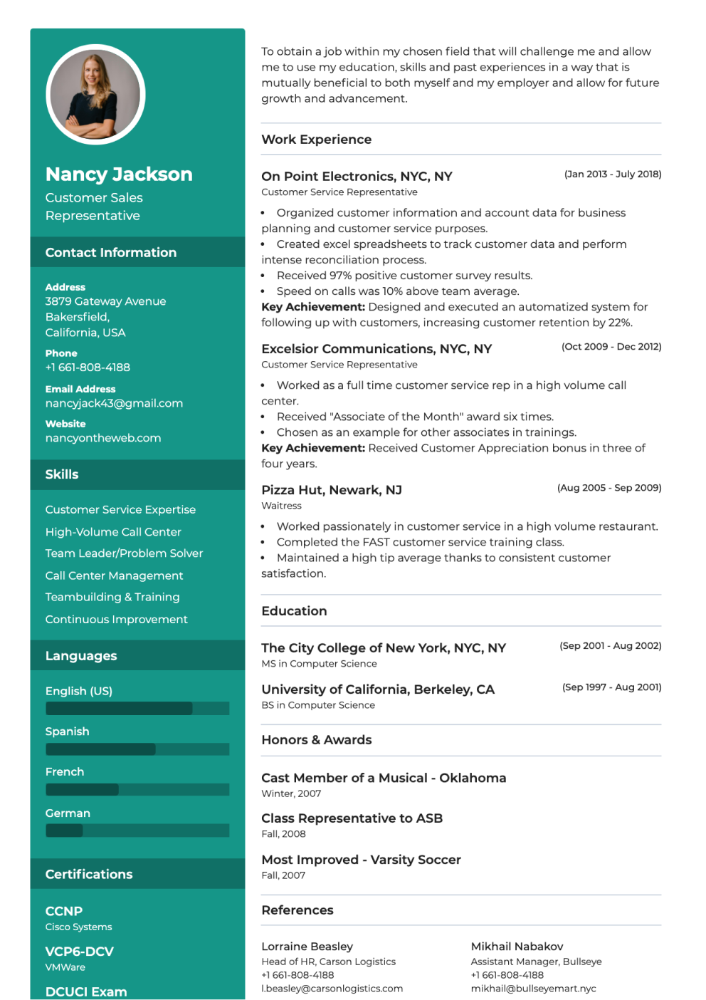
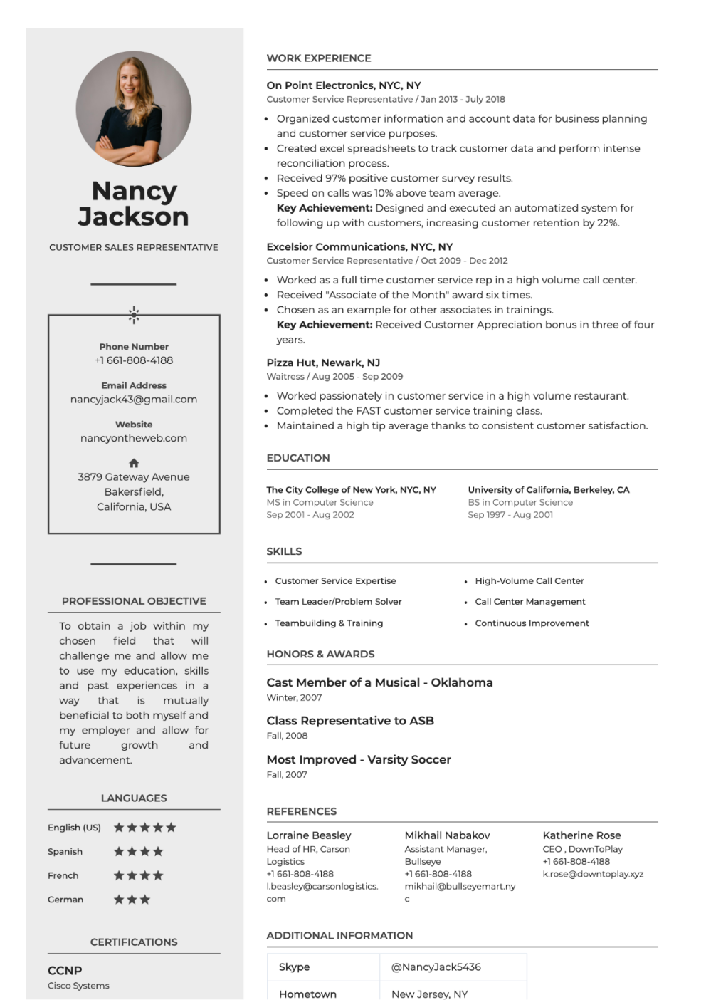
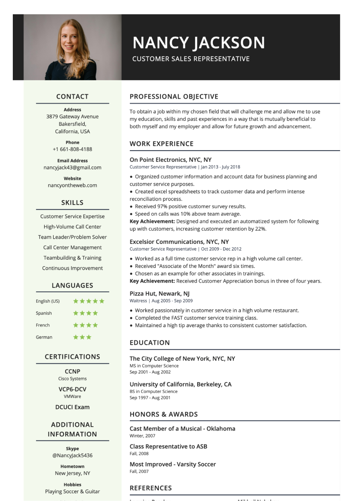

# Templates

  

    <h2 id="onyx"><a href="#onyx" class="header-anchor">#</a> Onyx</h2>
    
  

  

    <h2 id="pikachu"><a href="#pikachu" class="header-anchor">#</a> Pikachu</h2>
    
  

  

    <h2 id="gengar"><a href="#gengar" class="header-anchor">#</a> Gengar</h2>
    
  

  

    <h2 id="castform"><a href="#castform" class="header-anchor">#</a> Castform</h2>
    
  

  

    <h2 id="glalie"><a href="#glalie" class="header-anchor">#</a> Glalie</h2>
    
  

  

    <h2 id="celebi"><a href="#celebi" class="header-anchor">#</a> Celebi</h2>
    
  

