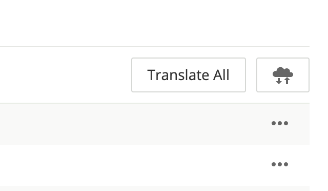
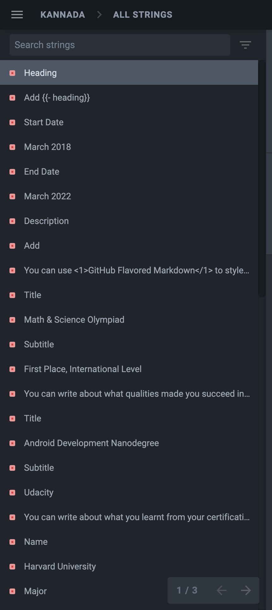
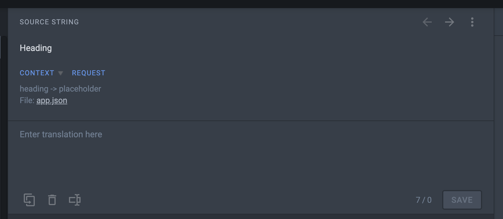
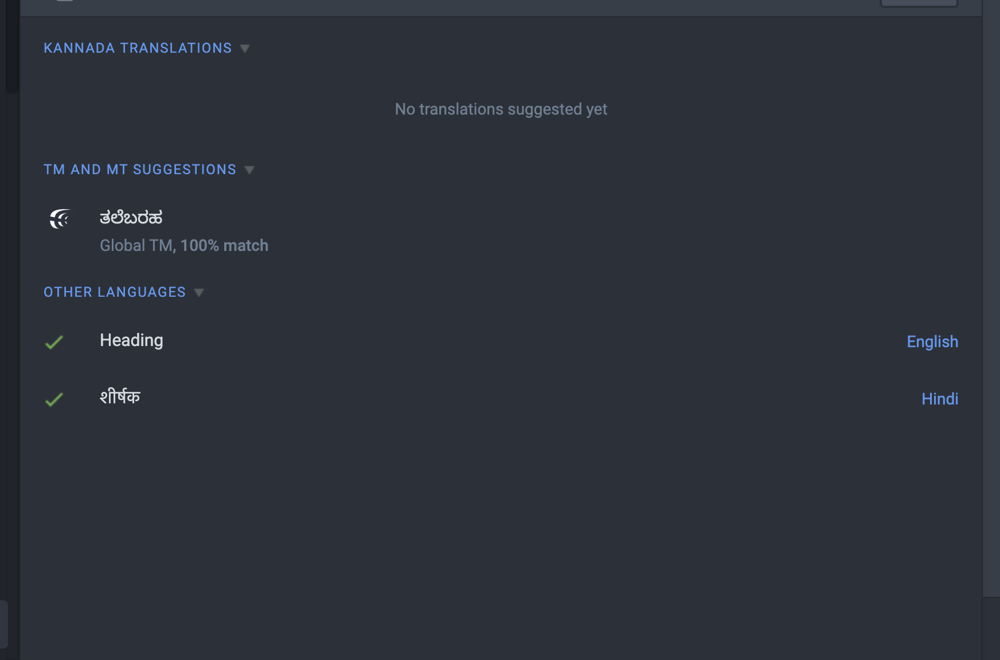

# Translation

Translating the app into your own language has never been easier. The project makes use of a powerful online tool called [Crowdin](https://crowdin.com/) to help manage translations and updates made to the app.

::: tip TL;DR
If you are already familiar with the Crowdin platform and want to contribute your time to translating a few strings, just head to the link below and get started!

### **[translate.rxresu.me](https://translate.rxresu.me/)**

:::

## Current Status

### Completed Translations

- Arabic `ar`
- Chinese Simplified `zh`
- Danish `da`
- Dutch `nl`
- English `en`
- French `fr`
- German `de`
- Hebrew `he`
- Hindi `hi`
- Italian `it`
- Kannada `kn`
- Polish `pl`
- Portuguese `pt`
- Russian `ru`
- Spanish `es`
- Tamil `ta`
- Vietnamese `vi`

### Pending Translations

- Afrikaans `af`
- Assamese `as`
- Catalan `ca`
- Czech `cs`
- Finnish `fi`
- Greek `el`
- Hebrew `he`
- Hungarian `hu`
- Japanese `ja`
- Korean `ko`
- Malayalam `ml`
- Marathi `mr`
- Norwegian `no`
- Punjabi `pa`
- Romanian `ro`
- Swedish `sv`
- Turkish `tr`
- Ukrainian `uk`

::: warning
If your language is not available in the list above, send me an email at <a href="mailto:im.amruth@gmail.com">im.amruth@gmail.com</a> with your request or raise an issue on GitHub and I'll add it on the Crowdin Platform.
:::

## Translating through Crowdin

### Step 1: Choose your Language

  

As mentioned above, all you need to do is go to the [Translation Portal ](https://translate.rxresu.me/) of Reactive Resume and select the language you want to begin translating to.

### Step 2: Click on `Translate All`

The PR would be accepted and merged only when the translations are 100% complete, which you can track through Crowdin.

  

### Step 3: Create an Account with Crowdin

You can use your email address and password, or for a quick getaway, use one of the many social providers to login quickly and get started.

### Step 4.1: List of Strings to be Translated

On the left sidebar, you can see a list of strings that are ready to be translated. The red box means it's not translated yet, and a green box means it has been translated to the target language.

  

### Step 4.2: Enter the Translation using the Editor

You can enter the translated string in the editor below. It is powerul enough to suggest you whether you have made any mistakes in the formatting of the string as well, and autocorrect them. Once you are done with the translation, click on the `Save` button.

::: tip
To make the process faster, you may also use Keyboard Shortcuts such as `Cmd/Ctrl + S`.
:::

  

### Step 4.3: Make Use of the Translation Suggestions

Crowdin is extremely powerful with NLP capabilities to understand your language and translate it automatically through numerous training provided through Open Source development. This will make your job much easier when translating from one language to another.

  

### Step 5: That's All Folks!

Once you have translated all the strings, the integration between Crowdin and GitHub would kick in and start replacing the updated strings in the repo. I would get a notification around the same time to merge the PR, and once that's done you can use the app in your own language and share it with others in your community!

## Translating through GitHub

For those who don't want to go through the process of creating an account with Crowdin and be continuous contributors to the project's translation, you can also perform a one-off translation by editing the JSON files through GitHub. Here's how:

### Step 1: Choose your Language

Go to the `src/i18n/locales` folder in the master branch of the repository and choose the language of your choice. Alternatively, you can [click this link](https://github.com/AmruthPillai/Reactive-Resume/tree/master/src/i18n/locales) to go the specific folder in GitHub.

Be careful as the folder only contains ISO-639-1 Two Letter Language Codes, so refer the [list above](#current-status) to find the corresponding language folder.

### Step 2: Fork the Repository, Edit the `.json` Files

By clicking on the Edit button in any of the files, it immediately creates a fork of the repository where you can edit the files at once. You may also choose to clone the forked repository locally and translate the strings using your favorite editor, then create a Pull Request for the changes.

---

While this is a bit more time consuming because of the structure of files that has been set up, for those who know what they are doing and want to get translating quickly without any help, this is the quickest method. But for those who would like to stay in constant touch with the project and provide translations for future updates to come, the Crowdin path is recommended.
