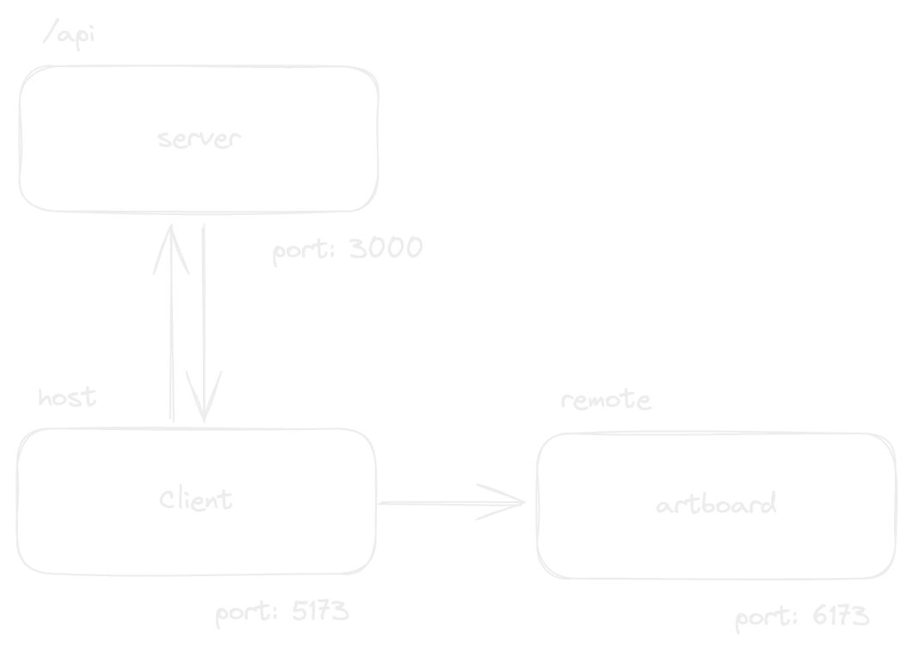

# 🔧 How It Works: The Frontend

<figure><figcaption></figcaption></figure>

There are two frontend applications written in React (Vite + SWC). One for the app itself, and one called the “artboard" which is in charge of displaying the resume as it was intended.

It's sort of a micro-frontend approach, without the host/remote connection or the necessary tooling for this to function. Instead, I make use of an `iframe` to display the remote application and `window.postMessage` to send data to the remote.

**The client's responsibilities include** everything you would expect from a regular frontend application:

* The rendering of the Homepage
* User Authentication & Account Management
* Client-Server Communication through Axios/React Query
* Editing the Resume (adding sections and editing metadata for the resume to make it personalized)

**The artboard’s responsibilities include:**

* Accepting resume data through the `message` event
* Setting up base styles for the page and shared styles for resumes
  * Uses CSS Variables to hoist colors and other style properties for components to consume them globally
* Loading the required fonts and icon libraries for the resume
* Deciding which template to display, depending on the resume metadata
* Displaying pages of the resume
  * Displays pages horizontally with page numbers and page line breaks, in **builder mode**
  * Displaying pages vertically one after another, in **printer mode and preview mode**

The motivation behind having two different applications is that the resume should not bleed any of the styles from the host application. The resume should have it's own space of managing stylesheets.

The artboard makes uses a combination of CSS Variables and Tailwind CSS to design resumes.

It also makes use of one of Tailwind’s first-class plugins `@tailwindcss/typography` to display content inside text blocks using the prose class. Since the prose class usually applies it's own text colors and font sizes, it is also important to override that with our own `text-color-text` class which is a shim to the CSS Variable `--color-text` defined in the resume metadata, and similar the `--font-size`.
